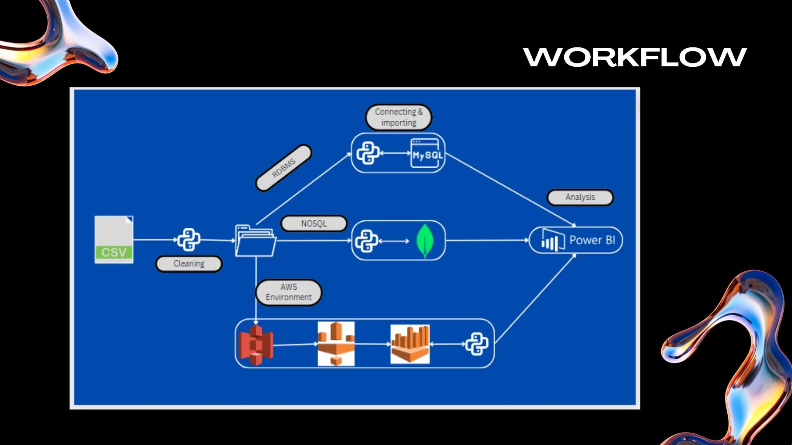

# Data Transparency in Motor Vehicle Crash Reporting

## Project Overview

This project aims to extract insights from the motor vehicle collision dataset, focusing on the date, time, location, and casualties involved in accidents. It also delves into the types of vehicles involved and the number of people injured or killed. The project will analyze crash patterns and their causes to improve road safety and inform future public policies.

## Dataset
- **Source:** [Motor Vehicle Collisions - Crashes](https://catalog.data.gov/dataset/motor-vehicle-collisions-crashes)
- **GitHub Repository:** [Data Transparency in Motor Vehicle Crash Reporting](https://github.com/pp11-web/Data-Transparency-in-Motor-Vehicle-Crash-Reporting)

## Motivation

The key motivation is to generate awareness about public safety and urban planning. Understanding motor vehicle collisions will aid in the formulation of improved traffic rules and more effective safety measures.

## Objectives
1. Perform data cleaning and preprocessing on a large dataset (~10 million rows).
2. Analyze the dataset using SQL and Python to derive meaningful insights.
3. Use RDBMS and NoSQL systems (MySQL, MongoDB) for storage and query analysis.
4. Create a visualization dashboard using Power BI to showcase the findings.

## Workflow

## Data Collection and Processing

The data is collected and cleaned to remove irrelevant fields (e.g., street names). The dataset is broken down into multiple tables such as:
- **Location:** Coordinates, borough, and crash time.
- **Vehicle:** Type of vehicle involved.
- **Casualty:** Number of injuries and fatalities.
- **Contributing Factors:** Primary causes of crashes.

### Data Cleaning & Preprocessing
- **Scenario 1: Using RDBMS (MySQL)**  
   Python was connected to MySQL using `mysql. connector`. However, due to the large dataset, PostgreSQL was chosen for better performance.
  
- **Scenario 2: Using MongoDB**  
   The dataset was also imported into MongoDB, allowing for flexible queries and faster retrieval. Key operations included CRUD and aggregation pipelines for more complex queries.

- **Scenario 3: Using AWS Environment**  
   AWS S3 was used to store data, AWS Glue for ETL, and AWS Athena for querying the data.

## Model Development
The analysis aimed to answer various questions:
1. Which months/years saw the highest number of accidents?
2. What are the most common types of vehicles involved in accidents?
3. Which factors contribute most to vehicle crashes?

## Results

- **Visualizations:**
   - Crashes by year
   - Contributing factors pie chart
   - Crash locations in New York (heatmap)

## Analytics & Data-Driven Decisions

Using Power BI, visualizations were created to analyze crash trends, fatality types, and injuries. Key findings:
- Accidents peaked between 3 PM and 6 PM.
- Motorcyclist fatalities increased during 2020-2021.
- Driver inattention was the most common cause of crashes, accounting for 41.72% of cases.

## Technical Challenges

- **RDBMS:** Importing large datasets into MySQL caused performance issues. We switched to PostgreSQL for efficiency.
- **MongoDB:** We faced challenges in identifying the best indexing methods.
- **AWS Environment:** Encountered issues with permissions in S3, metadata in Glue, and performance with Athena queries.

## Future Scope

1. **Improved Data Quality:** Explore advanced machine learning models to predict accident hotspots.
2. **Real-Time Data:** Integration with IoT devices for real-time crash monitoring.
